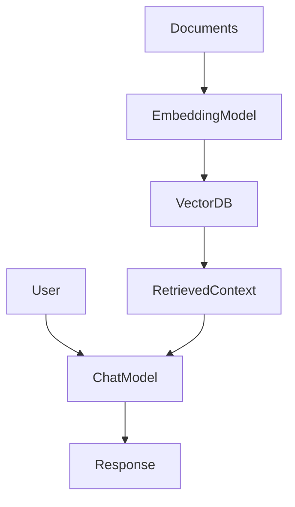

# Models in LangChain

## 1. Introduction

In LangChain, **models are the components that interact with AI providers to generate text or create embeddings**.

There are **two main categories of models**:

1. **Language Models**
2. **Embedding Models**

Language models themselves have **two types**:

* **LLMs (Legacy)**
* **Chat Models (Modern and recommended)**

Most modern AI applications built with LangChain today use **Chat Models + Embeddings**.

---

# 2. Language Models

Language models generate text responses from prompts.

LangChain historically supported two types:

| Type            | Description                                  | Status        |
| --------------- | -------------------------------------------- | ------------- |
| **LLMs**        | Text-in → Text-out models                    | Mostly legacy |
| **Chat Models** | Message-based models (system/user/assistant) | Recommended   |

---

## LLMs (Legacy)

LLMs accept a **single text prompt** and return a **text response**.

Example:

```text
Prompt → "Explain LangChain"
Response → "LangChain is a framework..."
```

These models do **not understand conversation roles** like system or user.

Example providers:

* OpenAI `text-davinci-003`
* Some older HuggingFace models

In LangChain these were used with classes like:

```python
from langchain_openai import OpenAI
```

However, **most providers have moved to chat-based models**, so traditional LLM usage is becoming **less common**.

---

## Chat Models (Recommended)

Chat models work with **structured messages instead of raw text**.

Messages usually have roles:

* **system** → instructions
* **user** → user input
* **assistant** → model response

Example interaction:

```text
System: You are a helpful assistant
User: Explain LangChain
Assistant: LangChain is a framework...
```

Advantages:

* Better reasoning
* Multi-turn conversations
* Supports tools
* Supports structured outputs

Most modern providers only release **chat models now**.

Examples:

* OpenAI `gpt-4o`
* OpenAI `gpt-4o-mini`
* Ollama `llama3`
* Anthropic `claude`
* Google `gemini`

---

## Code Example — Chat Model (OpenAI)

```python
from langchain_openai import ChatOpenAI

model = ChatOpenAI(
    model="gpt-4o-mini",
    temperature=0
)

response = model.invoke("Explain LangChain in one sentence")

print(response.content)
```

Key points:

* `ChatOpenAI` represents a **chat model**
* `invoke()` sends a message to the model
* Response is returned as a **message object**

---

## Code Example — Chat Model (Ollama Local)

```python
from langchain_ollama import ChatOllama

model = ChatOllama(
    model="llama3",
    temperature=0
)

response = model.invoke("What is RAG?")

print(response.content)
```

Benefits:

* Runs **locally**
* **No API cost**
* Good for **experiments and POCs**

---

## When to Use LLM vs Chat Model

| Use Case                     | Recommended Model |
| ---------------------------- | ----------------- |
| Modern AI apps               | Chat Model        |
| Agents                       | Chat Model        |
| Tool calling                 | Chat Model        |
| Structured outputs           | Chat Model        |
| Multi-turn conversation      | Chat Model        |
| Legacy single prompt systems | LLM               |

**Recommendation:**
Always prefer **Chat Models** for new applications.

---

# 3. Embedding Models

Embedding models convert text into **vectors (numbers)**.

Example:

```text
"LangChain is powerful"

→ [0.12, -0.41, 0.83, ...]
```

These vectors allow systems to measure **semantic similarity between texts**.

Common use cases:

* RAG
* Semantic search
* Document retrieval
* Recommendation systems

---

## Example — OpenAI Embeddings (Paid)

```python
from langchain_openai import OpenAIEmbeddings

embeddings = OpenAIEmbeddings(
    model="text-embedding-3-small"
)

vector = embeddings.embed_query("LangChain simplifies AI development")

print(len(vector))
```

---

## Example — Ollama Embeddings (Free Local)

```python
from langchain_ollama import OllamaEmbeddings

embeddings = OllamaEmbeddings(
    model="nomic-embed-text"
)

vector = embeddings.embed_query("LangChain simplifies AI development")

print(len(vector))
```

Popular Ollama embedding models:

* `nomic-embed-text`
* `mxbai-embed-large`

---

# 4. How Models Fit in AI Systems



Explanation:

1. Documents are converted to **embeddings**
2. Stored in **vector database**
3. Relevant context is retrieved
4. **Chat model generates final response**

This is the common **RAG architecture**.

---

# 5. Best Practices

**Prefer Chat Models**

Most LangChain features like:

* tool calling
* structured output
* agents

work best with **chat models**.

---

**Choose Embeddings Carefully**

Always use **same embedding model for indexing and querying**.

Mixing embedding models leads to **bad similarity search results**.

---

**Local vs API Models**

Use **Ollama** for:

* development
* POCs
* privacy

Use **OpenAI / hosted models** for:

* production
* higher quality results

---

# 6. Key Takeaways

• LangChain models fall into **Language Models and Embedding Models**

• Language models have **LLMs and Chat Models**

• **LLMs are mostly legacy**

• **Chat models are the modern standard**

• Embedding models convert text into **vectors for retrieval**

• Most real AI systems combine **Chat Models + Embeddings**

---

# 7. Next Topics

Next, learn how to structure inputs for models using [Prompts](../02_prompts/README.md)