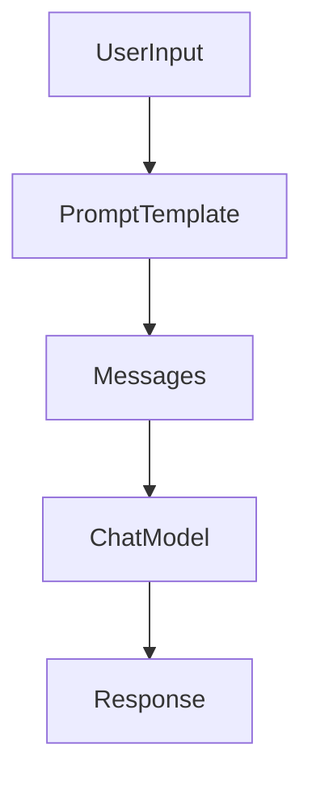

# Prompts in LangChain

## 1. Introduction

Prompts are **structured inputs sent to language models** to guide their responses.

In LangChain, prompts are typically built using **prompt templates** so they can be **reusable, dynamic, and composable in pipelines**.

Since **prompt engineering concepts are already covered in the prerequisites**, this section focuses on **how prompts are implemented in LangChain**. 

---

# 2. Static vs Dynamic Prompts

## Static Prompt

A static prompt is **fixed text** sent directly to the model.

Example:

```python
from langchain_openai import ChatOpenAI

model = ChatOpenAI(model="gpt-4o-mini")

response = model.invoke("Explain LangChain in one sentence")

print(response.content)
```

Problem with static prompts:

* Not reusable
* Hard to inject variables
* Difficult to maintain in pipelines

---

## Dynamic Prompt

Dynamic prompts allow **variables to be inserted into the prompt**.

Example:

```python
topic = "vector databases"

prompt = f"Explain {topic} in simple terms"
```

However, in LangChain we usually avoid manual formatting and use **Prompt Templates** instead.

---

# 3. PromptTemplate

`PromptTemplate` is used to create **dynamic prompts with variables**.

It helps:

* reuse prompts
* inject runtime values
* build composable pipelines

### Example

```python
from langchain_core.prompts import PromptTemplate

prompt = PromptTemplate.from_template(
    "Explain {topic} in simple terms"
)

formatted_prompt = prompt.invoke({"topic": "LangChain"})

print(formatted_prompt)
```

Output prompt sent to model:

```
Explain LangChain in simple terms
```

---

# 4. Messages in Chat Models

Modern models work with **message-based conversations**.

Common message roles:

| Role      | Purpose                |
| --------- | ---------------------- |
| system    | Defines model behavior |
| user      | User query             |
| assistant | Model response         |

Example structure:

```
System: You are a helpful AI assistant
User: Explain LangChain
Assistant: LangChain is a framework...
```

LangChain represents these messages as structured objects.

---

# 5. ChatPromptTemplate

`ChatPromptTemplate` is the **recommended way to build prompts for chat models**.

It allows defining **structured messages with variables**.

### Example

```python
from langchain_core.prompts import ChatPromptTemplate

prompt = ChatPromptTemplate.from_messages([
    ("system", "You are a helpful assistant"),
    ("user", "Explain {topic} in simple terms")
])

messages = prompt.invoke({"topic": "LangChain"})
```

The model receives:

```
System: You are a helpful assistant
User: Explain LangChain in simple terms
```

---

# 6. MessagePlaceholders

Sometimes prompts need **messages inserted dynamically**, such as:

* conversation history
* tool results
* agent scratchpad

For this LangChain provides **`MessagesPlaceholder`**.

### Example

```python
from langchain_core.prompts import ChatPromptTemplate, MessagesPlaceholder

prompt = ChatPromptTemplate.from_messages([
    ("system", "You are a helpful assistant"),
    MessagesPlaceholder("history"),
    ("user", "{question}")
])
```

Invocation:

```python
prompt.invoke({
    "history": [],
    "question": "What is LangChain?"
})
```

This allows **dynamic message injection at runtime**.

Common uses:

* chat history
* agent reasoning steps
* memory systems

---

# 7. Prompt Flow in LangChain



Explanation:

1. Input variables are passed to the prompt template
2. Template generates structured messages
3. Messages are sent to the chat model
4. Model generates the response

---

# 8. Best Practices

**Prefer ChatPromptTemplate**

Most modern models are **chat-based**, so this should be the default.

---

**Keep prompts reusable**

Define prompts once and reuse across chains and agents.

---

**Separate instructions from data**

Use structured messages:

* system → instructions
* user → task

---

**Use placeholders for dynamic data**

Useful for:

* memory
* agent workflows
* conversation history

---

# 9. Key Takeaways

• Prompts define **how models receive instructions**
• Static prompts are simple but **not reusable**
• `PromptTemplate` allows **dynamic variables**
• `ChatPromptTemplate` is used for **chat models**
• Messages provide **structured conversation roles**
• `MessagesPlaceholder` enables **dynamic message injection**

---

## Next Topic

Next, learn **How to get structured response** → [Structured Output](../03_structured_output/README.md)
