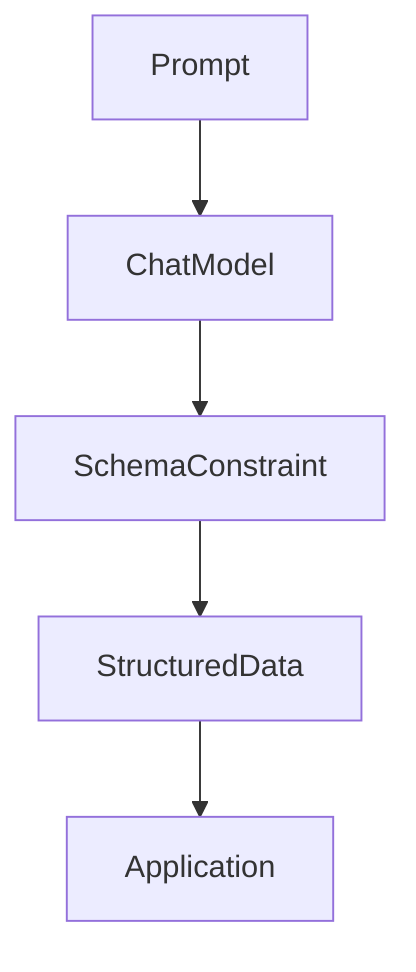

# Structured Output in LangChain

## 1. Introduction

By default, LLMs return **free-form text**, which is difficult to use directly in applications.

Structured output ensures the model returns **predictable, machine-readable data** such as JSON or typed objects.

Example:

Without structure

```text
Alice is 28 years old and her email is alice@example.com
```

With structure

```json
{
  "name": "Alice",
  "age": 28,
  "email": "alice@example.com"
}
```

LangChain allows constraining models to return structured responses using **`with_structured_output`**.

This makes the output **easier to validate, store, and integrate with other systems**. 

---

# 2. Why This Matters

Most real AI systems need **structured data instead of sentences**.

Common use cases:

* extracting structured data from documents
* parsing resumes
* ticket classification
* tool calling in agents
* API integrations
* database ingestion

Without structured output developers must **parse unreliable text**, which leads to fragile systems.

Structured output provides:

* predictable responses
* typed objects
* easier automation
* safer integrations

---

# 3. Two Approaches for Structured Output

There are two ways to get structured output in LangChain.

### 1. LLM-Native Structured Output (Preferred)

The **model itself is constrained to produce structured data** using function calling or response schemas.

LangChain enables this with:

```
with_structured_output()
```

Benefits:

* higher reliability
* no text parsing required
* validation through schema

---

### 2. Output Parsers (Fallback)

Output parsers **convert free-form text into structured data on the client side**.

Flow:

```
LLM text output → parser → structured data
```

This is useful when:

* the model **does not support native structured outputs**
* working with **legacy LLM APIs**

However, parsers are generally **less reliable than native structured outputs**.

---

# 4. Schema Types Supported

LangChain supports three schema formats.

## TypedDict

A lightweight Python typing construct for dictionaries.

Best for:

* quick prototypes
* simple schemas

Example:

```python
from typing import TypedDict

class Person(TypedDict):
    name: str
    age: int
    email: str
```

Pros

* lightweight
* no extra dependencies
* easy to write

Cons

* no runtime validation
* limited constraints

---

## Pydantic

Pydantic provides **runtime validation and type safety**.

Best for:

* production systems
* complex data models
* validation rules

Example:

```python
from pydantic import BaseModel, Field, EmailStr

class Person(BaseModel):
    name: str = Field(..., description="Person name")
    age: int = Field(..., ge=0)
    email: EmailStr
```

Pros

* runtime validation
* automatic type coercion
* nested models

Cons

* additional dependency
* slightly more verbose

---

## JSON Schema

JSON Schema is a **language-agnostic format** used widely in APIs.

Best for:

* cross-service contracts
* tool integrations
* API definitions

Example:

```python
person_schema = {
  "type": "object",
  "properties": {
    "name": {"type": "string"},
    "age": {"type": "integer"},
    "email": {"type": "string"}
  },
  "required": ["name", "age"]
}
```

Pros

* language independent
* widely supported
* rich validation options

Cons

* verbose
* less Pythonic

---

# 5. Code Example

### Using `with_structured_output`

```python
from pydantic import BaseModel, Field
from langchain_openai import ChatOpenAI

class Person(BaseModel):
    name: str = Field(description="Person name")
    age: int = Field(description="Person age")

model = ChatOpenAI(model="gpt-4o-mini", temperature=0)

structured_model = model.with_structured_output(Person)

result = structured_model.invoke(
    "Extract details: Alice is 28 years old"
)

print(result)
```

Output

```python
Person(name="Alice", age=28)
```

Steps:

1. Define schema
2. Attach schema to model
3. Model returns structured data

---

# 6. When to Use Which Schema

| Use Case                           | TypedDict | Pydantic   | JSON Schema   |
| ---------------------------------- | --------- | ---------- | ------------- |
| Quick prototype                    | ✅ Best    | ❌ Overkill | ❌ Too verbose |
| Simple flat schemas                | ✅ Best    | ⚠️ OK      | ⚠️ OK         |
| Complex nested objects             | ❌ Painful | ✅ Best     | ⚠️ Possible   |
| Validation rules (min, max, regex) | ❌ No      | ✅ Best     | ✅ Good        |
| Auto type coercion                 | ❌ No      | ✅ Yes      | ❌ No          |
| Production with strict validation  | ❌ No      | ✅ Best     | ⚠️ OK         |
| Cross-service contracts            | ❌ No      | ⚠️ OK      | ✅ Best        |
| IDE / static typing                | ✅ Yes     | ✅ Yes      | ❌ Poor        |

Quick rule:

* **Prototype → TypedDict**
* **Production → Pydantic**
* **API / cross-language systems → JSON Schema**

---

# 7. Structured Output Flow



Explanation:

1. Prompt sent to model
2. Model constrained by schema
3. Output returned as structured object
4. Application consumes structured data

---

# 8. Best Practices

**Prefer LLM-native structured output**

It is more reliable than parsing text.

---

**Keep schemas minimal**

More fields increase model failure rates.

---

**Use field descriptions**

Descriptions help the model understand each field.

---

**Add error handling**

Even structured outputs can fail.

---

# 9. Key Takeaways

• Structured output makes LLM responses **programmatically usable**
• Implemented using **`with_structured_output()`**
• Preferred over parsing text
• Supports **TypedDict, Pydantic, JSON Schema**
• Pydantic is best for **production systems**

---

Next, learn how to handle structured responses from models that **do not support native schemas using [Output Parsers](../04_output_parsers/README.md)**.
