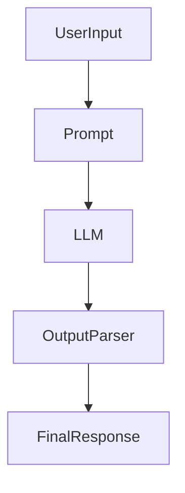
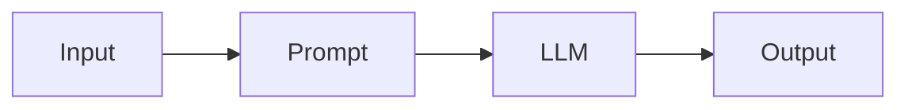
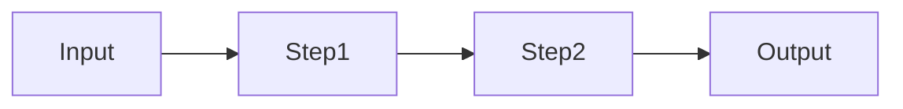
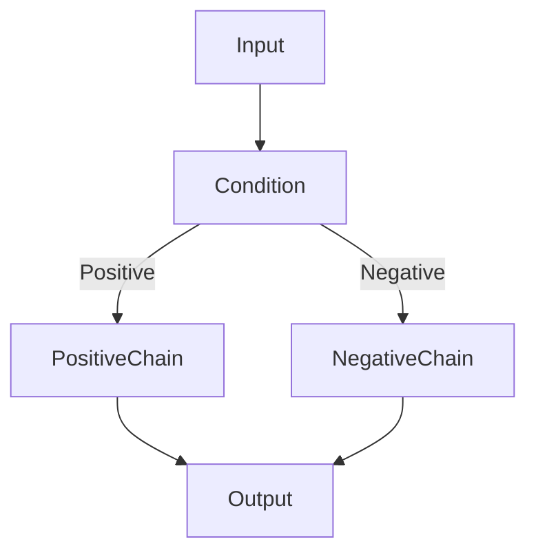

# Chains in LangChain

## 1. Introduction

A **Chain** in LangChain is a way to **combine multiple steps into a single workflow**.

Instead of calling a model directly, chains allow you to connect:

* prompts
* models
* parsers
* other chains

This makes it possible to build **structured AI pipelines** where the output of one step becomes the input of another.

Example pipeline:



Chains are commonly used to build:

* question answering systems
* summarization pipelines
* document processing workflows
* AI assistants

---

# 2. Why This Matters

Real AI applications rarely involve **just one LLM call**.

Most applications require multiple steps such as:

* formatting prompts
* retrieving context
* calling models
* parsing outputs
* applying logic

Chains help developers:

* structure AI workflows
* reuse components
* build maintainable pipelines
* compose complex AI systems

In modern LangChain, chains are often built using **LCEL (LangChain Expression Language)**.

---

# 3. Simple Chain

A **simple chain** connects a prompt to a model and optionally a parser.

Example workflow:



### Example

```python
from langchain_openai import ChatOpenAI
from langchain_core.prompts import ChatPromptTemplate
from langchain_core.output_parsers import StrOutputParser

model = ChatOpenAI(model="gpt-4o-mini")

prompt = ChatPromptTemplate.from_template(
    "Explain {topic} in simple terms"
)

chain = prompt | model | StrOutputParser()

result = chain.invoke({"topic": "LangChain"})

print(result)
```

Explanation:

* `prompt` formats the input
* `model` generates the response
* `StrOutputParser` returns plain text

---

# 4. Sequential Chain

A **sequential chain** executes multiple steps **one after another**, where each step uses the output from the previous step.

Example use case:

1. Generate a topic summary
2. Convert summary into bullet points



### Example

```python
from langchain_core.prompts import ChatPromptTemplate
from langchain_openai import ChatOpenAI
from langchain_core.output_parsers import StrOutputParser

model = ChatOpenAI(model="gpt-4o-mini")

summary_prompt = ChatPromptTemplate.from_template(
    "Write a short summary about {topic}"
)

bullet_prompt = ChatPromptTemplate.from_template(
    "Convert this summary into bullet points:\n{summary}"
)

summary_chain = summary_prompt | model | StrOutputParser()

chain = (
    {"summary": summary_chain}
    | bullet_prompt
    | model
    | StrOutputParser()
)

result = chain.invoke({"topic": "LangChain"})

print(result)
```

---

# 5. Conditional Chain

A **conditional chain** executes different workflows based on conditions.

Example:

* If sentiment is positive → respond politely
* If sentiment is negative → escalate



### Example Concept

```python
def route(sentiment):
    if sentiment == "positive":
        return positive_chain
    else:
        return negative_chain
```

Conditional chains are useful for:

* routing tasks
* classification workflows
* dynamic pipelines

---

# 6. Best Practices

### Keep Chains Modular

Break complex workflows into smaller chains.

---

### Use Parsers Early

Convert outputs into structured data whenever possible.

---

### Avoid Overly Long Chains

Large pipelines become difficult to debug.

---

### Prefer LCEL Pipelines

LCEL syntax (`|`) makes chains easier to compose and read.

---

# 7. Key Takeaways

* Chains combine multiple AI steps into workflows
* Used to build **structured LLM pipelines**
* Simple chains connect prompt → model → output
* Sequential chains run **multiple steps in order**
* Conditional chains enable **dynamic routing logic**

---

Next, learn how to build flexible pipelines using [LCEL Runnables](../06_runnables/README.md)