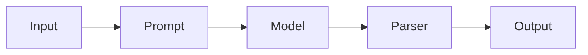
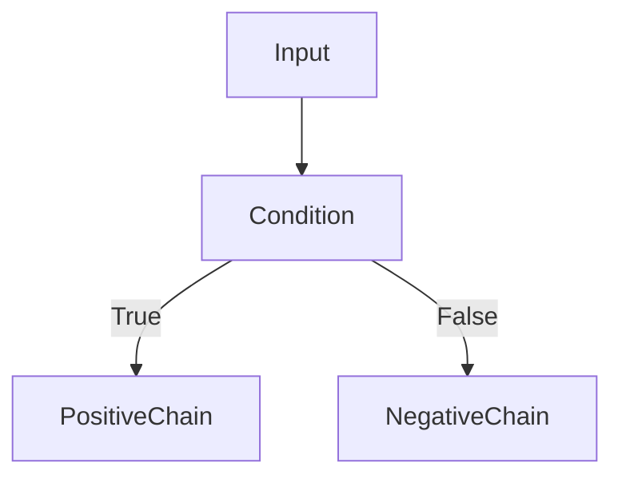

# Runnables in LangChain

## 1. Introduction

A **Runnable** in LangChain is any component that follows a **standard execution interface** for processing inputs and producing outputs.

In simple terms, a Runnable is **anything that can take input → process it → return output**.

Examples of components that are runnables:

* Prompt templates
* Chat / LLM models
* Output parsers
* Retrievers
* Chains

Because all these components implement the same interface, they can be **connected together into pipelines**.

Example pipeline:



Each step is a Runnable and the output flows automatically to the next step.

---

# 2. What Happened Before Runnables

Before Runnables were introduced, LangChain had **many different abstractions** like:

* `LLMChain`
* `SequentialChain`
* `RouterChain`
* `SimpleSequentialChain`

The main problem was that **each component had its own interface**.

Example differences:

| Component | Method                     |
| --------- | -------------------------- |
| Prompt    | `format()`                 |
| LLM       | `predict()` / `generate()` |
| Parser    | `parse()`                  |
| Chain     | `run()`                    |

Example workflow before runnables:

```python
prompt_text = prompt.format(topic="LangChain")

response = llm.predict(prompt_text)

parsed = parser.parse(response)
```

Problems:

* inconsistent APIs
* manual orchestration between steps
* harder composition of pipelines
* complex debugging
* limited support for streaming and async

---

# 3. How Runnables Solve This

Runnables introduced **one unified interface** across all components.

Now most components implement the same execution methods.

| Method      | Purpose                 |
| ----------- | ----------------------- |
| `invoke()`  | run a single input      |
| `batch()`   | process multiple inputs |
| `stream()`  | stream outputs          |
| `ainvoke()` | async execution         |

Example:

```python
result = runnable.invoke(input)
```

Because every component follows this interface, they can be easily composed.

Example pipeline:

```python
chain = prompt | model | parser

result = chain.invoke({"topic": "LangChain"})
```

The entire pipeline executes with **one invoke call**.

---

# 4. Relationship Between Chains and Runnables

In modern LangChain, **chains are built using runnables**.

Earlier:

```
Chain = special class
```

Now:

```
Chain = Runnable pipeline
```

Example:

```python
chain = prompt | model | parser
```

This pipeline is internally a **RunnableSequence**.

So when we write:

```python
chain.invoke(input)
```

We are actually executing a **Runnable**.

---

# 5. LCEL (LangChain Expression Language)

LCEL is the syntax used to **compose runnables together**.

Example operator:

```python
|
```

Example:

```python
chain = prompt | model | parser
```

Internally this creates:

```
RunnableSequence(prompt, model, parser)
```

Benefits of LCEL:

* clean syntax
* easy pipeline composition
* readable workflows

---

# 6. How to Identify a Runnable

A component is a Runnable if it supports methods like:

* `invoke()`
* `batch()`
* `stream()`

Example check:

```python
prompt.invoke(...)
model.invoke(...)
parser.invoke(...)
```

If a component can be used inside an LCEL pipeline like this:

```python
prompt | model | parser
```

then it is a **Runnable**.

Most modern LangChain components implement the Runnable interface.

---

# 7. Runnable Categories

Runnables can be grouped into two categories.

### Primitive Runnables

Low-level building blocks used to construct pipelines.

Examples:

* `RunnableSequence`
* `RunnableParallel`
* `RunnablePassthrough`
* `RunnableLambda`
* `RunnableBranch`

---

### Task-Specific Runnables

Higher-level components designed for specific tasks.

Examples:

* Chat models
* Prompt templates
* Retrievers
* Output parsers

These components internally implement the Runnable interface.

---

# 8. Primitive Runnables

## RunnableSequence

Executes runnables **one after another**.

Example:

```python
chain = prompt | model | parser
```

Pipeline:


---

## RunnableParallel

Runs multiple runnables **at the same time**.

Example:

```python
from langchain_core.runnables import RunnableParallel

chain = RunnableParallel(
    summary=summary_chain,
    keywords=keyword_chain
)
```

Output:

```python
{
  "summary": "...",
  "keywords": [...]
}
```

---

## RunnablePassthrough

Passes input forward **without modification**.

Example:

```python
from langchain_core.runnables import RunnablePassthrough

chain = {
    "question": RunnablePassthrough(),
    "context": retriever
}
```

---

## RunnableLambda

Wraps a Python function as a runnable.

Example:

```python
from langchain_core.runnables import RunnableLambda

def to_upper(text):
    return text.upper()

chain = RunnableLambda(to_upper)
```

---

## RunnableBranch

Allows **conditional execution** in pipelines.

Example:

```python
from langchain_core.runnables import RunnableBranch

branch = RunnableBranch(
    (lambda x: x["sentiment"] == "positive", positive_chain),
    negative_chain
)
```

Pipeline:



---

# 9. Runnable Pipeline Example

Example LCEL pipeline:

```python
chain = prompt | model | parser
```

Execution:

```python
result = chain.invoke({"topic": "LangChain"})
```

Flow:


---

# 10. Key Takeaways

* Runnables provide a **unified execution interface in LangChain**
* Earlier components had different methods (`format`, `predict`, `parse`, `run`)
* Runnables standardize execution using methods like `invoke()`
* Chains are now **built using runnable pipelines**
* LCEL is the syntax used to compose runnables (`|`)
* Primitive runnables enable sequential, parallel, and conditional workflows

---

Next, learn how to process long documents using [Document loaders](../07_document_loaders/README.md)