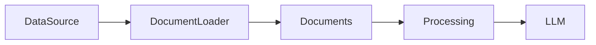
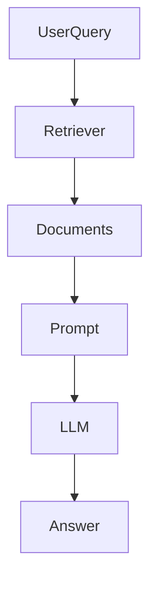
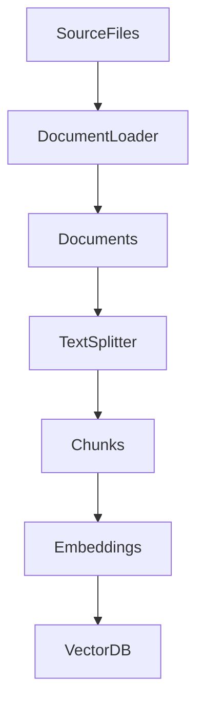

# Document Loaders in LangChain

## 1. Introduction

Most real-world AI applications need to work with **external data** such as:

* PDFs
* websites
* CSV files
* internal documentation
* databases

However, LLMs cannot directly read files or external sources.

To solve this, LangChain provides **Document Loaders**, which read data from various sources and convert it into a standardized **Document format**.

These documents can then be used for **retrieval, embeddings, and RAG pipelines**.

Typical pipeline:



---

# 2. What is RAG

**RAG (Retrieval Augmented Generation)** is a technique where an LLM retrieves relevant information from external data before generating a response.

Instead of relying only on training data, the model receives **context from documents**.

Basic RAG workflow:



Steps:

1. Documents are loaded using **document loaders**
2. Documents are split and converted to **embeddings**
3. Stored in a **vector database**
4. When a user asks a question, relevant documents are retrieved
5. The LLM uses those documents to generate an answer

Document loaders are the **first step of the RAG pipeline**.

---

# 3. Document Loaders in LangChain

Document loaders convert raw data into LangChain **Document objects**.

Each document contains:

* `page_content` → actual text
* `metadata` → information about the source

Example:

```python
Document(
    page_content="LangChain is a framework for building LLM applications.",
    metadata={"source": "article"}
)
```

These documents can later be:

* split into chunks
* embedded
* stored in vector databases
* retrieved during RAG

---

# 4. Text Loader

`TextLoader` loads simple text files.

Example:

```python
from langchain_community.document_loaders import TextLoader

loader = TextLoader("data.txt")

documents = loader.load()
```

Each file becomes one or more **Document objects**.

---

# 5. PyPDFLoader

`PyPDFLoader` loads content from PDF files.

Example:

```python
from langchain_community.document_loaders import PyPDFLoader

loader = PyPDFLoader("paper.pdf")

documents = loader.load()
```

Each page of the PDF becomes a separate document.

Example metadata:

```python
{
  "source": "paper.pdf",
  "page": 3
}
```

### Limitations

PyPDFLoader works well for simple PDFs but has some limitations:

* struggles with complex layouts
* tables may be extracted incorrectly
* scanned PDFs may not work well
* formatting can be lost

For complex PDFs, libraries like **Unstructured** are often used.

---

# 6. Directory Loader

`DirectoryLoader` loads multiple files from a folder.

Example:

```python
from langchain_community.document_loaders import DirectoryLoader

loader = DirectoryLoader("./docs")

documents = loader.load()
```

This is useful when working with large document collections.

Directory loader can combine with other loaders such as:

* PDF loader
* text loader
* CSV loader

---

# 7. load vs lazy_load

Most loaders provide two methods:

### load()

Loads all documents into memory at once.

Example:

```python
documents = loader.load()
```

Pros:

* simple
* good for small datasets

Cons:

* high memory usage for large datasets

---

### lazy_load()

Loads documents **incrementally**.

Example:

```python
for doc in loader.lazy_load():
    print(doc.page_content)
```

Pros:

* memory efficient
* scalable for large datasets

---

# 8. WebBaseLoader

`WebBaseLoader` loads content from web pages.

Example:

```python
from langchain_community.document_loaders import WebBaseLoader

loader = WebBaseLoader("https://example.com")

documents = loader.load()
```

This is commonly used to build **website-based RAG systems**.

---

# 9. CSV Loader

`CSVLoader` loads data from CSV files.

Example:

```python
from langchain_community.document_loaders import CSVLoader

loader = CSVLoader(file_path="data.csv")

documents = loader.load()
```

Each row becomes a document.

Example:

```text
Name: Alice
Age: 28
City: London
```

CSV loaders are useful for:

* structured datasets
* analytics pipelines
* tabular data ingestion

---

# 10. Other Document Loaders

LangChain supports many loaders for different platforms.

Some commonly used ones include:

| Loader                   | Source                   |
| ------------------------ | ------------------------ |
| `UnstructuredFileLoader` | multiple file types      |
| `NotionLoader`           | Notion pages             |
| `GoogleDriveLoader`      | Google Drive files       |
| `ConfluenceLoader`       | Confluence documentation |
| `SlackLoader`            | Slack conversations      |
| `S3Loader`               | AWS S3 storage           |

These loaders make it easier to build **knowledge-based AI systems**.

---

# 11. Custom Document Loader

Developers can also create **custom loaders** for internal systems or APIs.

Example:

```python
from langchain_core.documents import Document

def custom_loader():

    data = fetch_data_from_api()

    documents = [
        Document(
            page_content=item["text"],
            metadata={"source": "internal_api"}
        )
        for item in data
    ]

    return documents
```

This allows loading documents from:

* internal APIs
* databases
* enterprise systems

---

# 12. Document Loading Workflow

Typical data ingestion workflow:



Steps:

1. Load documents from data source
2. Split documents into smaller chunks
3. Convert chunks into embeddings
4. Store embeddings in vector database

---

# 13. Key Takeaways

* Document loaders read external data for LLM applications
* They convert data into LangChain **Document objects**
* Document loaders are the **first step of a RAG pipeline**
* LangChain provides loaders for files, websites, and cloud systems
* Developers can also build **custom loaders for internal data**

---

Next, learn how to process long documents using [Text Splitters](../08_text_splitters/README.md)