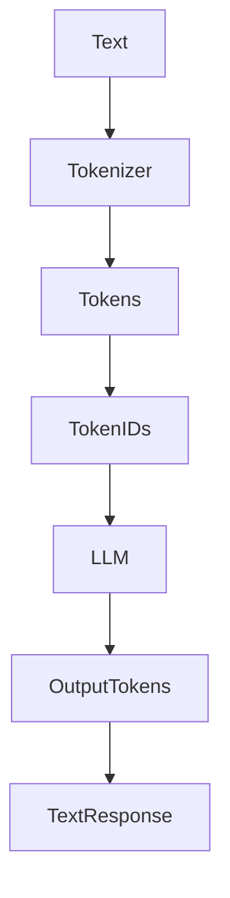

# Tokens and Tokenization

## 1. Introduction

Large Language Models (LLMs) do not understand raw text directly.
They process **tokens**, which are numerical representations of text.

A **token** is a small piece of text such as:

* a word
* part of a word
* punctuation
* or whitespace

Before a prompt reaches the model, it goes through **tokenization**, which converts text into tokens that the model can process. 

Example:

```
Hello, world!
```

May become tokens like:

```
["Hello", ",", " world", "!"]
```

Each token is then converted into a **token ID** (a number).

---

# 2. Why This Matters

Understanding tokens is important for developers because:

### Context Length

LLMs have a **maximum token limit**.

Examples:

| Model       | Context Window |
| ----------- | -------------- |
| GPT-4o mini | ~128k tokens   |
| GPT-4       | ~8k–32k tokens |
| Claude      | ~100k+ tokens  |

If your prompt exceeds the limit, the request **fails or gets truncated**.

---

### Cost

Most LLM APIs charge **per token**.

```
Cost = input tokens + output tokens
```

Large prompts → higher cost.

---

### Performance

More tokens means:

* higher latency
* more compute
* slower responses

---

# 3. How Tokenization Works

Tokenization converts text into token IDs used by the model.



Steps:

1. Raw text input
2. Tokenizer splits text into tokens
3. Tokens mapped to **token IDs**
4. IDs sent to model
5. Model generates next tokens

---

# 4. Code Example

### Counting Tokens with `tiktoken`

```python
import tiktoken

text = "LangChain makes building LLM apps easier."

encoding = tiktoken.encoding_for_model("gpt-4o-mini")

tokens = encoding.encode(text)

print(tokens)
print("Token count:", len(tokens))
```

Example output:

```
[9906, 25812, 2531, ...]
Token count: 8
```

---

### Decoding Tokens

```python
decoded = encoding.decode(tokens)

print(decoded)
```

Output:

```
LangChain makes building LLM apps easier.
```

---

# 5. Tokenization Types

### Word Tokenization

Splits by words.

Example:

```
"I love AI"

→ ["I", "love", "AI"]
```

Problem:

* vocabulary becomes too large

---

### Character Tokenization

Splits by characters.

```
AI → ["A", "I"]
```

Problem:

* sequences become very long

---

### Subword Tokenization (Most Common)

Modern LLMs use **subword tokens**.

Example:

```
unbelievable

→ ["un", "believ", "able"]
```

Advantages:

* handles unknown words
* smaller vocabulary
* better efficiency

---

# 6. Best Practices

### Keep Prompts Short

Remove unnecessary text to reduce tokens.

---

### Monitor Token Usage

Track tokens in production to control cost.

---

### Chunk Long Documents

Long documents should be split before sending to models.

Example pattern used in RAG systems.

---

### Use the Correct Tokenizer

Different models use **different tokenizers**.

Example:

* OpenAI → `tiktoken`
* HuggingFace → `tokenizers`

---

# 7. Key Takeaways

• LLMs process **tokens, not raw text**
• Tokenization converts text into numerical token IDs
• Token limits define **context window size**
• API cost depends on **token usage**
• Subword tokenization is the most common approach

---

Next, learn how these tokens are used inside models in **[How LLMs Work](02_how_llms_work.md)**.
