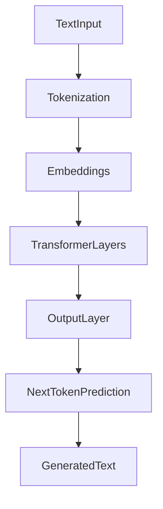
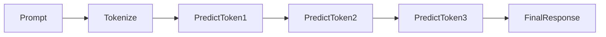

# How Large Language Models Work

## 1. Introduction

Large Language Models (LLMs) are AI systems trained to **predict the next token in a sequence of text**.

They do not truly understand language like humans. Instead, they learn **patterns from massive amounts of text data** and use those patterns to generate responses. 

For example:

```text
Input: The capital of France is
```

The model predicts the next token:

```text
Paris
```

By repeatedly predicting the next token, LLMs can generate **sentences, paragraphs, and even entire documents**.

---

## 2. Why This Matters

Understanding how LLMs work helps developers:

* design better prompts
* reduce hallucinations
* build reliable AI systems
* debug model behavior

LLMs are fundamentally **probabilistic text generators**, not knowledge databases.

Knowing this mental model helps avoid common mistakes when building AI applications.

---

## 3. High-Level Architecture

Modern LLMs are built using **transformer neural networks**.

At a high level, the processing pipeline looks like this:



Steps:

1. Input text is converted into **tokens**
2. Tokens are converted into **vector embeddings**
3. Transformer layers process relationships between tokens
4. The model predicts the **next token**
5. The process repeats until the response is complete

---

## 4. The Generation Process

When a user sends a prompt, the model generates output **one token at a time**.

Example:

Prompt:

```text
Explain LangChain in simple terms
```

Generation process:



Each new token prediction is based on:

* the original prompt
* previously generated tokens

This process continues until:

* a stop token is produced
* the token limit is reached

---

## 5. Training Process

LLMs are trained in two main stages.

### Pretraining

The model learns language patterns by predicting missing tokens from large datasets.

Example training task:

```text
Input: The cat sat on the
Target: mat
```

The model adjusts internal parameters to improve predictions.

Large models are trained on:

* books
* websites
* code
* research papers

---

### Fine-Tuning

After pretraining, models are refined for specific tasks.

Examples:

* chat assistants
* coding copilots
* domain-specific models

Fine-tuning improves:

* instruction following
* reasoning
* response quality

---

## 6. Important Parameters

LLM behavior can be controlled using parameters.

### Temperature

Controls randomness.

| Temperature      | Behavior               |
| ---------------- | ---------------------- |
| Low (0–0.3)      | deterministic, factual |
| Medium (0.4–0.7) | balanced               |
| High (0.8–1.0)   | creative               |

Example:

```python
temperature=0
```

Used when responses must be **consistent and predictable**.

---

### Max Tokens

Limits response length.

Example:

```python
max_tokens=200
```

Prevents extremely long responses.

---

## 7. Limitations of LLMs

LLMs have several limitations.

### No True Understanding

They predict patterns but do not **truly comprehend meaning**.

---

### Training Data Cutoff

Models cannot access information beyond their training data unless connected to external systems.

---

### Hallucinations

LLMs may produce **confident but incorrect answers** when uncertain.

---

### Weak Mathematical Reasoning

They are better at **language patterns** than strict logical reasoning.

---

## 8. Key Takeaways

* LLMs work by **predicting the next token**
* Built using **transformer neural networks**
* Text is converted into **tokens → embeddings → predictions**
* Responses are generated **one token at a time**
* Training happens through **pretraining and fine-tuning**
* Understanding these mechanics helps build **better AI systems**

---

Next, learn about the architecture powering modern LLMs in **[Transformers](03_transformers.md)**.
