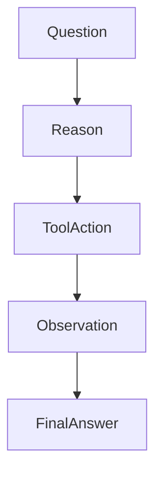

# Prompt Engineering

## 1. Introduction

Prompt engineering is the practice of **designing inputs that guide Large Language Models to produce reliable and useful outputs**.

Since LLMs generate responses based on **patterns in text**, the quality of the output heavily depends on how the prompt is written. 

A well-designed prompt clearly specifies:

* the role of the model
* the task to perform
* relevant context
* the expected output format

Example:

```text
Explain the difference between REST and GraphQL for backend engineers.
```

Clear prompts significantly improve response quality.

---

## 2. Why This Matters

LLMs are **probabilistic text generators**, not reasoning engines.

Prompt engineering helps developers:

* improve response accuracy
* control output format
* reduce hallucinations
* guide reasoning
* integrate LLMs into applications

Most real-world LLM systems rely heavily on **well-structured prompts**.

---

## 3. Components of a Good Prompt

A structured prompt usually includes the following components.

| Component     | Purpose                         |
| ------------- | ------------------------------- |
| Role          | Defines model behavior          |
| Task          | Describes what needs to be done |
| Context       | Provides relevant information   |
| Instructions  | Guides reasoning                |
| Output Format | Specifies structure of response |

Example:

```text
Role: You are a senior data analyst.

Task: Analyze the dataset summary.

Context: The dataset contains customer transactions.

Instructions: Identify trends and anomalies.

Output Format: Return results as bullet points.
```

---

## 4. Prompting Techniques

Different techniques improve model reliability depending on the task.

### Zero-Shot Prompting

Provide only the instruction.

```text
Classify the sentiment of this sentence:

"The product works great."
```

Output:

```text
Positive
```

---

### Few-Shot Prompting

Provide examples to guide the model.

```text
Sentence: I love this laptop.
Sentiment: Positive

Sentence: This phone is terrible.
Sentiment: Negative

Sentence: The battery is average.
Sentiment:
```

Few-shot prompts help the model learn the expected pattern.

---

### Chain-of-Thought Prompting

Encourages the model to reason step-by-step.

Example:

```text
Solve step by step.

If a train travels 60 km per hour for 4 hours, how far does it travel?
```

This improves reasoning for complex problems.

---

### ReAct Prompting

Used in **AI agents that interact with tools**.

The model alternates between:

* reasoning
* tool actions
* observations



---

## 5. Best Practices

### Be Specific

Bad prompt:

```text
Explain databases
```

Better prompt:

```text
Explain the difference between relational and NoSQL databases for backend engineers.
```

---

### Provide Context

Context helps the model produce more accurate responses.

---

### Define Output Format

Structured outputs reduce ambiguity.

Example:

```text
Return the answer in this format:

Cause:
Impact:
Fix:
```

---

### Limit Scope

Avoid overly broad prompts.

Focused prompts produce better results.

---

## 6. Prompt Templates

Prompt templates make prompts **reusable and dynamic**.

Example template:

```text
You are a {role}

Task:
{task}

Context:
{context}

Instructions:
{instructions}

Output Format:
{format}
```

Templates are widely used in:

* LangChain
* RAG pipelines
* AI agents

---

## 7. Key Takeaways

* Prompt engineering guides LLM behavior
* Clear prompts produce more reliable outputs
* Good prompts define **role, task, context, and output format**
* Techniques include **zero-shot, few-shot, and chain-of-thought**
* Prompt templates help build scalable AI systems

---

Next, learn how LLMs represent meaning numerically using **[Embeddings](05_embeddings.md)**.
