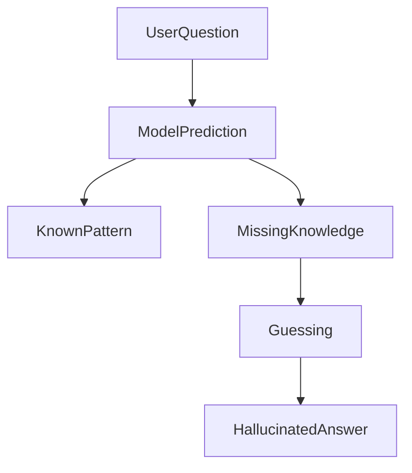

# Hallucinations in Large Language Models

## 1. Introduction

AI hallucinations occur when a Large Language Model generates **information that appears correct but is actually incorrect or fabricated**.

The model may produce confident answers even when the information is **not present in its training data or context**. 

Example hallucination:

```text
Question: Who invented the programming language Python?

Answer: Guido van Rossum in 1991.   ✅ Correct
```

But sometimes the model may produce:

```text
Answer: Python was invented by James Gosling in 1995. ❌ Incorrect
```

The response may sound convincing even though it is wrong.

---

# 2. Why Hallucinations Happen

LLMs are **pattern prediction systems**, not truth verification systems.

They generate responses by predicting the most probable sequence of tokens based on training data.

When the model lacks information, it may still produce a response based on patterns.



Key reasons hallucinations occur:

* incomplete training data
* ambiguous prompts
* lack of grounding in external knowledge
* pressure to produce an answer

---

# 3. Types of Hallucinations

### Factual Hallucinations

Incorrect facts.

Example:

```text
The first moon landing happened in 1967
```

Actual year: **1969**

---

### Contextual Hallucinations

The model ignores information provided in the prompt or context.

---

### Mathematical Hallucinations

Incorrect calculations or reasoning.

---

### Fabricated Sources

The model invents:

* research papers
* citations
* companies
* historical events

---

# 4. Real-World Impact

Hallucinations can cause serious problems in real applications.

Examples:

| Domain           | Risk                         |
| ---------------- | ---------------------------- |
| Healthcare       | incorrect medical advice     |
| Legal            | fabricated legal citations   |
| Finance          | incorrect financial analysis |
| Customer support | wrong product information    |

Because of this, **LLM outputs should always be validated** in critical applications.

---

# 5. How to Reduce Hallucinations

### Provide Clear Context

Well-defined prompts reduce uncertainty.

Example:

```text
Answer only using the information provided below.
```

---

### Use Retrieval-Augmented Generation (RAG)

Instead of relying on training data, the system retrieves documents and provides them to the model.


This grounds responses in real documents.

---

### Add Guardrails

Guardrails restrict model behavior.

Example rules:

```text
If the answer is not known, respond with:
"I don't have enough information to answer."
```

---

### Validate Responses

Applications can add validation layers to check:

* factual accuracy
* format
* consistency

---

# 6. Best Practices

### Avoid Open-Ended Prompts

Vague prompts increase hallucination risk.

---

### Provide Context

Context improves accuracy.

---

### Ask for Sources

Prompt example:

```text
Provide sources for your answer.
```

---

### Implement Verification

Critical applications should use:

* external databases
* RAG pipelines
* human review

---

# 7. Key Takeaways

* Hallucinations are **incorrect or fabricated AI outputs**
* They occur because LLMs predict patterns rather than verify facts
* Hallucinations increase when context is missing
* Techniques like **RAG and guardrails reduce hallucination risk**
* Critical systems should always include **validation mechanisms**

---

Next, learn how to build simple LLM workflows using **[GuardRails](07_guardrails.md)**.
