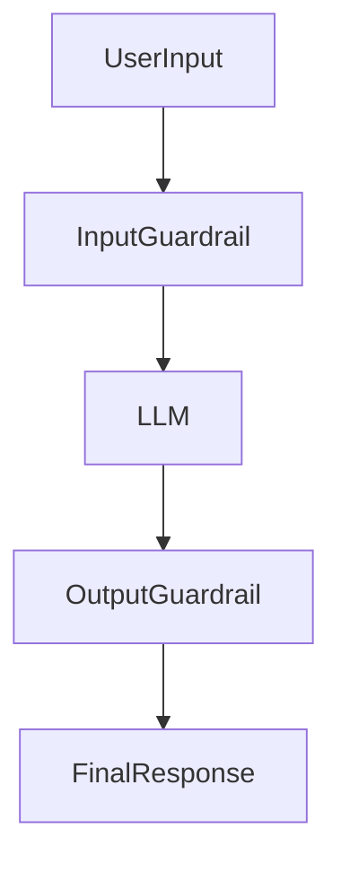

# Guardrails

## 1. Introduction

Guardrails are **safety mechanisms that control how AI systems behave**.

They help prevent models from generating **harmful, unsafe, or inappropriate responses** while still allowing useful outputs.

Guardrails act like **protective boundaries** that guide model behavior within safe limits. 

Example:

If a user asks for illegal instructions, a guardrail system can block the request before it reaches the model.

---

# 2. Why This Matters

LLMs can generate powerful outputs, but without safeguards they may produce:

* harmful content
* unsafe instructions
* sensitive information
* policy violations

Guardrails are important for:

* production AI systems
* enterprise applications
* regulated industries

They ensure AI systems remain **safe, reliable, and compliant**.

---

# 3. Types of Guardrails

## Input Guardrails

Input guardrails check **user input before it reaches the model**.

Example checks:

* harmful instructions
* illegal activities
* prompt injection attempts

Example concept:

```python
def validate_input(text):
    banned_words = ["hack", "illegal", "exploit"]

    for word in banned_words:
        if word in text.lower():
            return False

    return True
```

If the input is unsafe, the system can block or modify it.

---

## Output Guardrails

Output guardrails validate **model responses before returning them to the user**.

They help detect:

* harmful instructions
* unsafe content
* policy violations

Example concept:

```python
def validate_output(response):
    banned_words = ["harm", "illegal"]

    for word in banned_words:
        if word in response.lower():
            return False

    return True
```

---

# 4. Guardrail Pipeline

Guardrails are usually implemented as a **multi-layer safety system**.



Steps:

1. User input is validated
2. Safe input is sent to the LLM
3. Model generates a response
4. Output validation checks the response
5. Safe response is returned to the user

---

# 5. Guardrail Strategies

### Content Filtering

Detect harmful content using rules or classifiers.

---

### Rate Limiting

Prevent abuse by limiting request frequency.

---

### Confidence Thresholds

Reject responses when model confidence is too low.

---

### Safety Policies

Define rules that restrict model behavior.

Example:

```text
Do not provide illegal instructions.
Do not generate harmful content.
If unsure, say you do not know.
```

---

# 6. Best Practices

### Layer Multiple Guardrails

Use both **input and output validation**.

---

### Fail Safely

If uncertain, block the response instead of allowing risky content.

---

### Monitor Guardrail Performance

Track:

* blocked requests
* false positives
* failure cases

---

### Update Safety Rules

Guardrails should evolve as new risks appear.

---

# 7. Key Takeaways

* Guardrails are **safety mechanisms for AI systems**
* They control **input and output behavior**
* Prevent harmful or unsafe responses
* Implemented using **filters, policies, and validation layers**
* Essential for **production AI applications**

---

Next, learn how to ensure response quality using **[Validations](08_validations.md)**.
