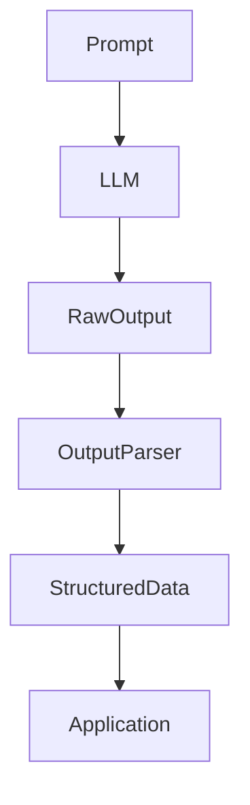

# Output Parsers in LangChain

## 1. Introduction

LLMs usually return **free-form text**, which is difficult to use directly in applications.

**Output parsers** convert model responses into **structured formats** such as strings, JSON, or Python objects.

Instead of manually parsing responses, LangChain provides **Output Parsers** that transform model output into predictable data formats.

Example:

LLM response:

```text
Name: Alice
Age: 28
```

Parsed output:

```json
{
  "name": "Alice",
  "age": 28
}
```

Output parsers are mainly used when **LLM models do not support built-in structured outputs**.

If a model supports native structured output (like `with_structured_output`), that approach is usually **preferred**.

---

# 2. Why This Matters

Most applications require **structured data**, not natural language.

Examples:

* extracting fields from documents
* converting responses into JSON
* integrating LLM outputs with APIs
* building automation pipelines

Output parsers help:

* enforce output format
* reduce parsing errors
* convert responses into programmatically usable data

---

# 3. When to Use Output Parsers

Output parsers are typically used when:

| Scenario                                     | Use Output Parser                 |
| -------------------------------------------- | --------------------------------- |
| Model does **not support structured output** | ✅ Yes                             |
| Working with older LLM APIs                  | ✅ Yes                             |
| Model returns text only                      | ✅ Yes                             |
| Model supports `with_structured_output`      | ❌ Prefer native structured output |

Recommended approach:

1. Use **LLM-native structured output** when available
2. Use **output parsers as fallback**

---

# 4. Types of Output Parsers in LangChain

LangChain provides several built-in parsers.

| Parser                   | Purpose                                |
| ------------------------ | -------------------------------------- |
| `StrOutputParser`        | Return raw string output               |
| `JsonOutputParser`       | Convert output into JSON               |
| `StructuredOutputParser` | Enforce expected fields                |
| `PydanticOutputParser`   | Validate outputs using Pydantic models |

Each parser provides increasing levels of **structure and validation**.

---

# 5. StrOutputParser

`StrOutputParser` returns the **raw text output** from the model.

Useful when structured data is not required.

### Example

```python
from langchain_core.output_parsers import StrOutputParser
from langchain_openai import ChatOpenAI
from langchain_core.prompts import ChatPromptTemplate

model = ChatOpenAI(model="gpt-4o-mini")

prompt = ChatPromptTemplate.from_template(
    "Explain {topic} in one sentence"
)

chain = prompt | model | StrOutputParser()

result = chain.invoke({"topic": "LangChain"})

print(result)
```

---

# 6. JSON Output Parser

`JsonOutputParser` instructs the model to return **JSON formatted output**.

### Example

```python
from langchain_core.output_parsers import JsonOutputParser
from langchain_openai import ChatOpenAI
from langchain_core.prompts import ChatPromptTemplate

model = ChatOpenAI(model="gpt-4o-mini")

parser = JsonOutputParser()

prompt = ChatPromptTemplate.from_template(
    "Return person info as JSON: {text}"
)

chain = prompt | model | parser

result = chain.invoke({
    "text": "Alice is 28 years old"
})

print(result)
```

Example output:

```json
{
  "name": "Alice",
  "age": 28
}
```

### Drawback

JSON responses may still be **invalid or inconsistent** if the model does not strictly follow the format.

---

# 7. StructuredOutputParser

`StructuredOutputParser` allows defining **expected fields** in advance.

It generates **format instructions** that guide the model.

### Example

```python
from langchain.output_parsers import StructuredOutputParser, ResponseSchema

schemas = [
    ResponseSchema(name="name", description="person name"),
    ResponseSchema(name="age", description="person age")
]

parser = StructuredOutputParser.from_response_schemas(schemas)

format_instructions = parser.get_format_instructions()
```

This improves reliability compared to raw JSON parsing.

### Improvement over JSON parser

* defines expected fields
* generates format instructions
* improves consistency

### Drawback

Still **does not enforce strict type validation**.

Example issue:

```json
{
  "age": "twenty eight"
}
```

---

# 8. PydanticOutputParser

`PydanticOutputParser` adds **strict validation using Pydantic models**.

### Example

```python
from pydantic import BaseModel
from langchain.output_parsers import PydanticOutputParser

class Person(BaseModel):
    name: str
    age: int

parser = PydanticOutputParser(pydantic_object=Person)
```

Output becomes a validated Python object.

Example result:

```python
Person(name="Alice", age=28)
```

### Advantages

* type validation
* schema enforcement
* clear errors for invalid outputs

Example failure:

```json
{
  "age": "twenty eight"
}
```

This will raise a **validation error**.

---

# 9. JSON vs Structured vs Pydantic

| Feature                | JSON Parser | Structured Parser | Pydantic Parser |
| ---------------------- | ----------- | ----------------- | --------------- |
| JSON formatting        | ✅           | ✅                 | ✅               |
| Schema definition      | ❌           | ✅                 | ✅               |
| Type validation        | ❌           | ❌                 | ✅               |
| Python object output   | ❌           | ❌                 | ✅               |
| Production reliability | ⚠️ Medium   | ⚠️ Medium         | ✅ High          |

Quick guideline:

* **JSON parser → simple extraction**
* **Structured parser → enforce fields**
* **Pydantic parser → production validation**

---

# 10. Can We Build Custom Parsers?

Yes. LangChain allows developers to create **custom output parsers** by extending the base parser class.

Example:

```python
from langchain_core.output_parsers import BaseOutputParser

class UppercaseParser(BaseOutputParser):

    def parse(self, text: str):
        return text.upper()
```

Usage:

```python
chain = prompt | model | UppercaseParser()
```

This allows creating custom parsing logic when built-in parsers are not sufficient.

---

# 11. Parser Workflow



Steps:

1. Prompt sent to LLM
2. LLM generates text
3. Parser processes response
4. Structured data returned to application

---

## Other Output Parsers Available

LangChain also provides several additional output parsers for specific use cases.

Some commonly available parsers include:

| Parser                           | Purpose                                     |
| -------------------------------- | ------------------------------------------- |
| `CommaSeparatedListOutputParser` | Parses comma-separated values into a list   |
| `ListOutputParser`               | Converts output into a Python list          |
| `MarkdownListOutputParser`       | Extracts list items from markdown responses |
| `BooleanOutputParser`            | Converts responses into boolean values      |
| `DatetimeOutputParser`           | Parses datetime values                      |
| `EnumOutputParser`               | Restricts output to predefined enum values  |
| `RegexParser`                    | Extract values using regex patterns         |
| `RetryOutputParser`              | Retries parsing if the first attempt fails  |

These parsers are useful when extracting **specific formats or constrained outputs**.

Full list of available parsers can be found in the LangChain documentation:

**[https://python.langchain.com/docs/modules/model_io/output_parsers/](https://python.langchain.com/docs/modules/model_io/output_parsers/)**


# 12. Best Practices

Prefer **LLM-native structured output** when available.

Use output parsers when:

* models do not support structured output
* working with legacy APIs
* parsing custom formats

For production systems, prefer **Pydantic parsers for validation**.

---

# 13. Key Takeaways

* Output parsers convert LLM responses into structured data
* Used mainly when **models do not support native structured outputs**
* `StrOutputParser` returns raw text
* `JsonOutputParser` extracts JSON responses
* `StructuredOutputParser` enforces field structure
* `PydanticOutputParser` adds strict validation
* Custom parsers can be implemented for specialized parsing logic

---

Next, learn how to build LLM workflows using [Chains](../05_chains/README.md)