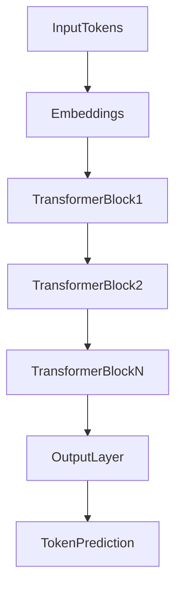
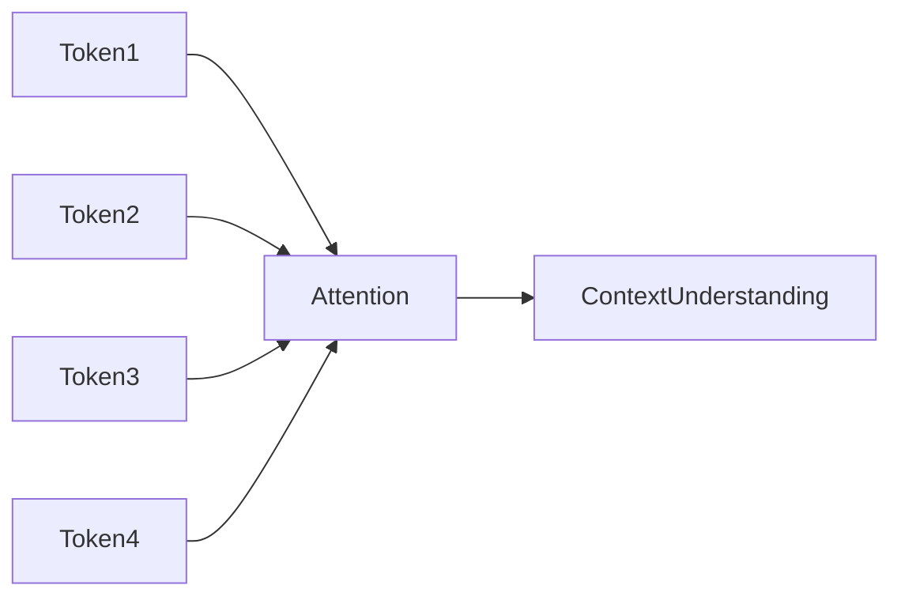
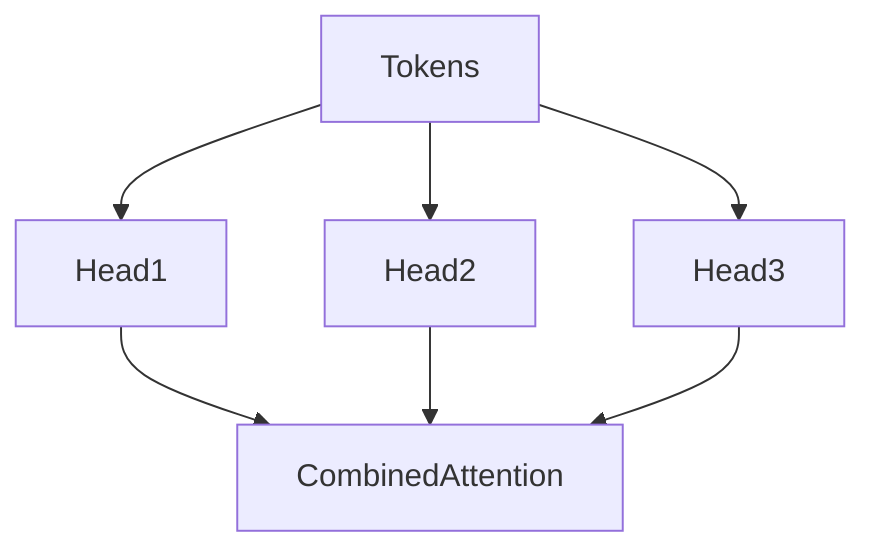

# Transformers

## 1. Introduction

Modern Large Language Models such as GPT, Claude, and Gemini are built using the **Transformer architecture**.

Transformers are neural network models designed to **understand relationships between tokens in a sequence of text**. 

Before transformers, models processed text **sequentially**, which made it difficult to understand long-range dependencies in sentences.

Transformers solved this using a mechanism called **attention**, allowing the model to analyze **all tokens at once**.

---

## 2. Why This Matters

Transformers enabled the rapid progress in AI because they allow models to:

* understand long context
* process text in parallel
* capture relationships between distant words
* scale to extremely large models

Nearly all modern AI systems are built on transformers:

* GPT models
* Claude
* Gemini
* LLaMA
* Mistral

Understanding transformers helps developers understand **why LLMs behave the way they do**.

---

## 3. Transformer Architecture

At a high level, transformers process input text using **attention layers and neural networks**.



Each transformer block contains two main components:

1. **Self-Attention**
2. **Feed Forward Network**

---

## 4. Self-Attention

Self-attention allows each token to **focus on other relevant tokens in the sentence**.

Example sentence:

```text
The bank by the river is beautiful
```

The word **bank** should pay attention to **river**, not finance.

Attention allows the model to identify such relationships.



Each token calculates how much it should **attend to other tokens**.

This helps the model understand context.

---

## 5. Multi-Head Attention

Instead of using a single attention mechanism, transformers use **multiple attention heads**.

Each head learns different relationships.

Example:

| Attention Head | Focus                   |
| -------------- | ----------------------- |
| Head 1         | grammar                 |
| Head 2         | semantic meaning        |
| Head 3         | long-range dependencies |



This allows the model to capture **multiple perspectives of language simultaneously**.

---

## 6. Types of Transformer Models

Different architectures use transformers differently.

### Encoder Models

Examples:

* BERT

Used for:

* classification
* search
* embeddings

---

### Decoder Models

Examples:

* GPT
* LLaMA

Used for:

* text generation
* chat systems
* code generation

---

### Encoder-Decoder Models

Examples:

* T5
* BART

Used for:

* translation
* summarization
* sequence-to-sequence tasks

---

## 7. Challenges with Transformers

Although powerful, transformers have some limitations.

### Computational Cost

Attention requires large matrix operations, which makes training expensive.

---

### Context Length Limits

Attention grows quadratically with sequence length.

Long documents require more memory.

---

### Training Resources

Training large transformers requires:

* massive datasets
* GPUs or specialized hardware
* large training budgets

---

## 8. Key Takeaways

• Transformers power modern AI systems
• They use **self-attention to understand relationships between tokens**
• Attention allows models to process **entire sequences simultaneously**
• Multi-head attention captures **different language patterns**
• Most modern LLMs use **decoder-based transformers**

---

Next, learn how developers guide LLM behavior using **[Prompt Engineering](04_prompt_engineering.md)**.
