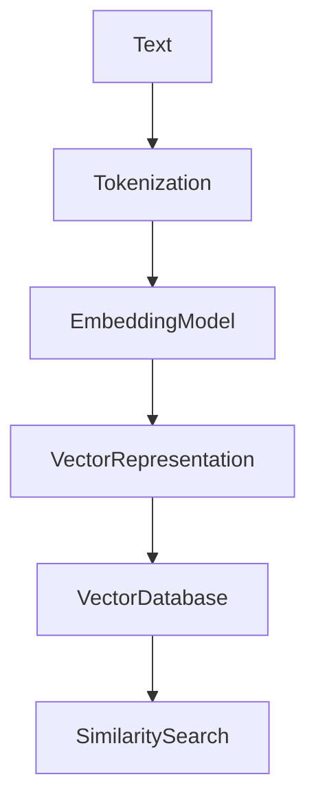
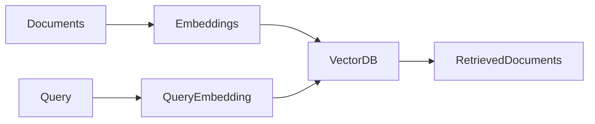

# Embeddings

## 1. Introduction

Embeddings are **numerical vector representations of text** that capture semantic meaning.

Instead of working directly with words, AI models convert text into **vectors (lists of numbers)** that represent meaning in a high-dimensional space. 

Example:

```text
"LangChain is powerful"
```

May become:

```text
[0.12, -0.43, 0.88, ...]
```

Texts with similar meanings produce **similar vectors**.

Example:

* "car"
* "vehicle"

Their embeddings will be **close together in vector space**.

---

# 2. Why This Matters

Embeddings power many modern AI systems.

Common applications include:

* semantic search
* document retrieval
* recommendation systems
* clustering similar content
* Retrieval Augmented Generation (RAG)

Instead of matching keywords, embeddings allow systems to search by **meaning**.

Example:

Query:

```text
How do transformers work?
```

Documents containing:

```text
Neural network architectures for language models
```

can still be retrieved because their **embeddings are similar**.

---

# 3. How Embeddings Work

The embedding process converts text into vectors that capture relationships between words and concepts.



Steps:

1. Text is tokenized
2. Tokens are processed by an embedding model
3. The model produces a **vector**
4. Vectors are stored in a **vector database**
5. Similar vectors are retrieved during search

---

# 4. Types of Embeddings

## Word Embeddings

Each word is mapped to a vector.

Example models:

* Word2Vec
* GloVe

Limitation:

* the same word always has the **same vector**, regardless of context.

---

## Contextual Embeddings

Modern models generate embeddings that depend on context.

Example:

```text
bank
```

In:

```text
river bank
```

vs

```text
financial bank
```

The embeddings will be **different**.

Examples:

* BERT
* GPT embeddings

---

## Sentence and Document Embeddings

Entire sentences or documents can also be converted into vectors.

Example:

```text
How transformers work
```

becomes one vector representing the **entire meaning of the sentence**.

These are commonly used in:

* semantic search
* RAG systems
* clustering

---

# 5. Measuring Similarity

Embeddings allow measuring similarity between texts using vector math.

The most common method is **cosine similarity**.

Higher similarity means vectors are **closer in semantic space**.

Example concept:

```python
similarity = cosine_similarity(query_vector, document_vector)
```

If similarity is high, the document is considered **relevant**.

---

# 6. Example Workflow

Example semantic search workflow:

1. Convert documents into embeddings
2. Store embeddings in a vector database
3. Convert user query into embedding
4. Find nearest vectors
5. return relevant documents



This pattern is widely used in **RAG pipelines**.

---

# 7. Best Practices

### Use the Same Embedding Model

The same embedding model must be used for:

* document indexing
* query embedding

Mixing models leads to poor similarity results.

---

### Batch Embeddings

Generating embeddings in batches improves performance.

---

### Choose the Right Model

Consider:

* vector size
* speed
* domain relevance

---

### Store Embeddings Efficiently

Embeddings are often stored in **vector databases** such as:

* Pinecone
* Weaviate
* Chroma
* FAISS

---

# 8. Key Takeaways

• Embeddings convert text into **vector representations**
• Similar meanings produce **similar vectors**
• Used for **semantic search and retrieval systems**
• Similarity is typically measured using **cosine similarity**
• Embeddings are a core building block of **RAG systems**

---

Next, learn about **[Hallucinations](06_hallucinations.md)** and why LLMs sometimes generate incorrect information.
